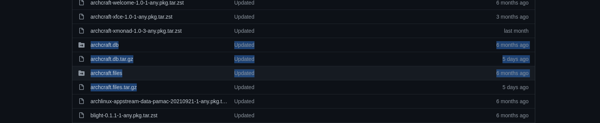

# arch-setup
this configuration is buildable
```
sudo mkarchiso . 
```
 [archiso](https://wiki.archlinux.org/title/archiso)

## install

extract image into a partition

installed packages:
- slurp
- wl-clipboard
- grim
- sway

## [packages: host custom package gh-pages](https://www.youtube.com/watch?v=CYqd2AHXosk)
to make a custom repo is enogut to create a folder under `x86_64/` and run
```
repo-add 'name.db.tar.gz' *.pkg.tar.zst
```
to create a db.
Like this



In the pacman.conf insted add this.

```
[custom]
SigLevel = Optional DatabaseOptional
Server = https://zanovelloalberto.github.io/arch-setup/$arch
```


## Screen share

[ ] make it work


#### reference
- https://github.com/emersion/xdg-desktop-portal-wlr/wiki/%22It-doesn't-work%22-Troubleshooting-Checklist
- https://github.com/SeaDve/Kooha


<br/>

## Reference 

### ArchWiki

- [diskless_system](https://wiki.archlinux.org/title/diskless_system)
- [archiso](https://wiki.archlinux.org/title/archiso)
- [Display_manager](https://wiki.archlinux.org/title/Display_manager)
- [wayland](https://wiki.archlinux.org/title/wayland)
- [Autostarting](https://wiki.archlinux.org/title/Autostarting)


